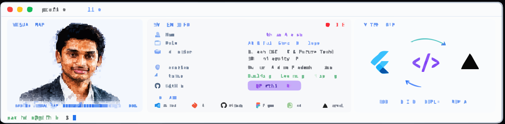

<!-- ===================== PROFILE BANNER ===================== -->

  <picture>
    <source media="(prefers-color-scheme: dark)" srcset="./dark.svg">
    <source media="(prefers-color-scheme: light)" srcset="./light.svg">
    
  </picture>

 

<!-- ===================== INTRO ===================== -->

<h1 align="center">👋 Hey, I'm B. Parthiva Aneesh</h1>

  <strong>AI & Future Technologies Student • AI Developer • Full Stack Developer</strong>

  
  
  

  

---

# 👋 About Me

I'm **B. Parthiva Aneesh**, a **Computer Science Engineering (AI & Future Technologies)** student at **SRM University AP** with a **CGPA of 9.08**.

I build **AI-powered products**, **modern web applications**, and **intelligent software** that solve real-world problems.

My primary interests are:

- 🤖 Artificial Intelligence
- 🧠 Large Language Models (LLMs)
- 🔍 Retrieval-Augmented Generation (RAG)
- 🤝 AI Agents
- 🌐 Full Stack Development
- ⚡ Modern Web Technologies

---

# 🚀 Current Focus

## 🎯 Building NextStep AI

> **Your Next Step, Powered by AI**

An AI-powered student career intelligence platform that helps students understand their career readiness using intelligent insights, resume analysis, AI recommendations, and personalized learning roadmaps.

### Current Learning

- 🦜 LangChain
- 🕸️ LangGraph
- 🤖 AI Agents
- 🔍 RAG Pipelines
- 🧠 OpenAI APIs
- 🏗️ System Design
- ⚡ Full Stack AI Development

---

# 💼 Experience

## 🚀 Front-end AI Engineering Intern — FlyRank AI

- Building AI-powered user interfaces
- Integrating Large Language Models
- Performance optimization
- Modern React development

## 🌍 Open Source Contributor — GirlScript Summer of Code

- Contributed to multiple open-source repositories
- Collaborated using Git & GitHub
- Built developer utilities
- Worked with React & TypeScript

## 💻 Web Developer — InAmigos Foundation

- AI Blog Writing
- LinkedIn Content Strategy
- React Development
- UX/UI Improvements

## 💼 Web Developer Intern — SkillCraft Technology

- React Applications
- REST APIs
- PostgreSQL
- Authentication
- Tailwind CSS

---

# 🚀 Featured Projects

## 🎯 NextStep AI

### AI-powered Student Career Intelligence Platform

**Features**

- 📄 Resume Analysis
- 📊 Placement Readiness Score
- 🧠 AI Career Guidance
- 🎯 Skill Gap Detection
- 🗺️ Personalized Learning Roadmaps
- 🔎 AI Opportunity Matching

**Tech Stack**

`Next.js` `TypeScript` `Tailwind CSS` `Supabase` `PostgreSQL` `OpenAI APIs`

---

## 🧘 Haven — Safe Space

Privacy-first emotional wellness platform helping users manage stress through breathing exercises, mood tracking, and personal reflections.

**Tech Stack**

`React` `TypeScript` `Tailwind CSS` `Framer Motion`

---

## ⭐ RateFluencer Studio

Transparent review platform for creator-led products, communities, and courses.

**Tech Stack**

`React` `Tailwind CSS` `Node.js` `Express`

---

## 🗳️ Election Guide AI

Multilingual AI assistant helping users understand elections, voting, and ballot measures.

**Tech Stack**

`React` `Gemini API` `Tailwind CSS` `Framer Motion`

---

## 🌐 Premium Portfolio

A premium animated portfolio built using modern web technologies.

**Tech Stack**

`Next.js 15` `React Three Fiber` `Three.js` `GSAP` `Framer Motion`

---

# 🛠️ Tech Stack

### 💻 Languages

  

### 🎨 Frontend

  

### ⚙️ Backend

  

### 🗄️ Database

  

### 🤖 AI / LLM

  

  <code>OpenAI APIs</code>
  <code>LangChain</code>
  <code>LangGraph</code>
  <code>Hugging Face</code>
  <code>RAG</code>
  <code>AI Agents</code>
  <code>LLMs</code>

---

# ⚙️ Tools

  

---

# 🏆 Certifications

- ✅ AI Agents Fundamentals — Hugging Face
- ✅ AI Fluency Framework — Anthropic
- ✅ Prompt Engineering Guide — Google
- ✅ Introduction to Generative AI Studio — Simplilearn
- ✅ Claude 101 — Anthropic

---

# 🎓 Education

### SRM University AP

**Bachelor of Technology**

Computer Science Engineering

**Specialization:** Artificial Intelligence & Future Technologies

🎯 **CGPA: 9.08**

---

# 📊 GitHub Analytics

  
  

  

---

# 🐍 Contribution Snake

  <picture>
    <source
      media="(prefers-color-scheme: dark)"
      srcset="https://raw.githubusercontent.com/Parthiva302/Parthiva302/output/github-snake-dark.svg"
    >
    <source
      media="(prefers-color-scheme: light)"
      srcset="https://raw.githubusercontent.com/Parthiva302/Parthiva302/output/github-snake.svg"
    >
    
  </picture>

---

# 📫 Connect With Me

---

# 💡 Quote

> *"Building intelligent products isn't just about AI—it's about solving meaningful problems that improve people's lives."*

---

# ⚡ Fun Fact

I enjoy transforming ideas into real products by combining **Artificial Intelligence**, **Full Stack Development**, and **Creative Problem Solving**.

---

  <strong>CODE • BUILD • DEPLOY • REPEAT</strong>

  Built with curiosity, caffeine & continuous learning ☕

